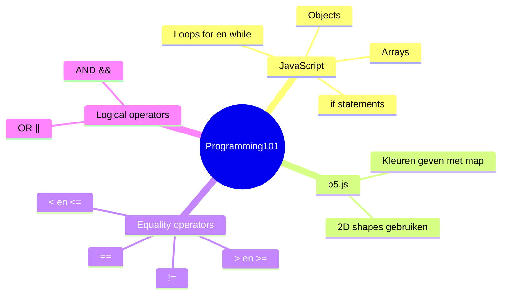
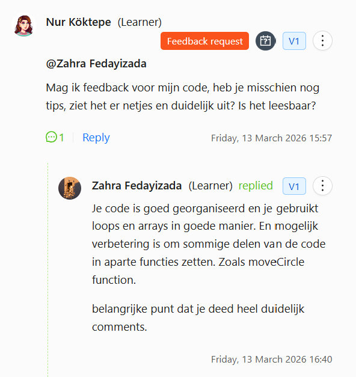
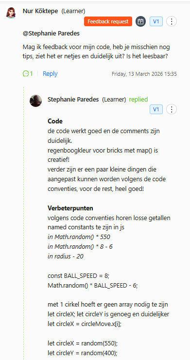

# Programming101 project Nur Köktepe

Voor dit project heb ik een game gebouwd met p5js. Ik heb een breakout game gemaakt maar dan in mijn eigen stijl. Ik heb bijvoorbeeld het hoofdje van mij kat gebruikt en daarom het het Mia Breakout. Ik vond het een leerzaam en creatief project.


## JavaScript

| Code      | Gebruik                                                                           |
|-----------|-----------------------------------------------------------------------------------|
| `let`     | Voor variabelen die kunnen veranderen                                             |
| `const`   | Voor variabelen met een constante waarde                                          |
| `if()`    | Voert een blok code uit als de voorwaarde waar is                                 |
| `for()`   | for loop kunnen een blok code een aantal keer uitvoeren                           |
| `function`| Functies zijn herbruikbare codeblokken die ontworpen zijn voor specifieke taken   |


## Code Block 

**Voorbeelden uit mijn code:**

```javascript
// voorbeeld object
let snelheid = {
    x: [],
    y: []
}

// voorbeeld nested loop
for (let row = 0; row < numRows; row++) {
        brickActive[row] = [];
        for (let col = 0; col < numRects; col++) {
            brickActive[row][col] = true;
        }
}

// voorbeeld if() statement
if (circleMove.x[i] > 620) {
            snelheid.x[i] *= -1;
}

// voorbeeld van een function()
function resetBricks() {
    // laad alle bricks opniew in wanneer je op reset button klikt
    for(let row = 0; row < numRows; row++) {
        for(let col = 0; col < numRects; col++) {
            brickActive[row][col] = true;
        }
    }
}
```


## Bronvermelding

> Hoe krijg je je canvas gecentreerd:
 [Centering Canvas by jm8785](https://editor.p5js.org/jm8785/sketches/r0DMO5Mqj)

> Collisions in p5js:
 [How to create collisions, walls, and barriers in the P5.js programming language - Jason Erdreich](https://youtu.be/JV5XBmaQdIA?si=lqgvkTtV9AhM4rcz)

> Website over verschillende collisions:
 [COLLISION DETECTION - Jeff Thompson](https://www.jeffreythompson.org/collision-detection/table_of_contents.php)

> Buttons maken in p5js:
 [How to create an on-screen button in the P5.js programming language - Jason Erdreich](https://www.youtube.com/watch?v=HfvTNIe2IaQ)

> Hoe maak je een start scherm:
 [One way to create a starting screen by using modes by rmacdonald](https://editor.p5js.org/rmacdonald/sketches/M_1rwzEaa)

> Game over en victory scherm:
 [Game Basics in p5.js Part 8 - Game Over and Win screens - Computing Masterclass](https://www.youtube.com/watch?v=zrxw7HG8254&t=8s)

> Een afbeedling uploaden en in een shape zetten:
 [Fill rect with image by jeremydouglass](https://editor.p5js.org/jeremydouglass/sketches/T2ooOe6Nx)

> Hoe je cursor() verandert:
 [p5.js cursor()](https://p5js.org/reference/p5/cursor/)


## Wat heb ik geleerd?




# Peer-review checklist 

Feedback gekregen van klasgenoten:




> ✅ Start de demo: werkt het zonder console‑errors?

> ✅ Interactie: doen beide acties wat ze moeten doen?

> ✅ Variabelen/loops/functions/arrays/if’s aanwezig en functioneel?

> ✅ Code leesbaar: namen duidelijk, geen duplicatie, geen dode code.

> ✅ Performance: geen zware berekeningen in draw() zonder noodzaak.

> ✅ README compleet; credits voor externe assets staan erbij.